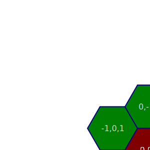
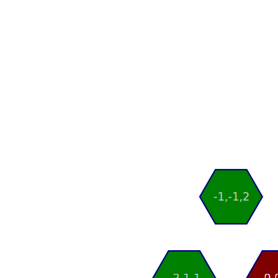

# Yet Another Hex Graph, in typescript

hexgraph is an implementation of [Amit Patel][redblob]'s
[Hexagonal Grids][hexgrid] in TypeScript. I have built on the
[implementation][heximp] with other ideas, including relationship graphs between
grid parts.

## Motivation

I love turn-based roleplaying and strategy games, and I wanted to learn a whole
bunch of things about programming and math all at once, so I thought "let's
build a game library!" I was intrigued by the hexagonal grid concept in Sid
Meier games and thought to use it to learn a language. The point of the exercise
is to build -- rather than to use -- the library, so YAGNI doesn't apply.

## Getting Started

Clone the repo, `npm run deploy && npx http-server` to run the demo locally

## Documentation

The mathematical concepts are [thoroughly discussed][hexgrid], so I will stick
to the hows and whys of my implementation.

I wrote in TypeScript because that's what I'm trying to learn.

I've chosen to use cube coordinates for algorithmic simplicity. All
coordinate-based functions accept cube coordinates, which allows passing
`HexNode`s around as parameters.




## Task List

- tests
- ~~cell labelling~~
- ~~cell groups~~
  - ~~line~~
  - ~~ring~~
  - ~~hexagon~~
  - ~~cone (triangle with origin and direction)~~
- ~~cell group overlaps~~
- rotation (next node in a cycle around a node)

    redblobgames has code for this for cells, how hard to generalize for nodes?
- rounding
  - ~~nearest cell~~
  - nearest edge, nearest vertex
  
      ```ts
      let spot: QRSVector; // this is the location on the grid we're trying to round
      let cell: HexNode = Hex.round(spot);
      let offset: QRSVector = Hex.subtract(spot, cell);
      ```
  
      and then with <https://www.redblobgames.com/grids/hexagons/directions.html> we have the vertex
      toward the direction (including sign) of the largest offset magnitude, bob's your uncle.
      these line up with the diagonal directions, and by the same idea we address the neighbor
      directions, or pairs of vertex directions.
  
      ```ts
      // vertex directions cycle
      [q, -r, s, -q, r, -s] /* or */ [q, -s, r, -q, s, -r]
      ```
  
      ```ts
      // edge direction cycle
      [(q,-r), (-r,s), (s,-q), (-q,r), (r,-s), (-s,q)]
      // or in the other direction
      [(q,-s), (-s,r), (r,-q), (-q,s), (s,-r), (-r,q)]
      ```
  
      How much do I care about offering both directions? and starting from different nodes? Those
      things are basically arbitrary, though the order is significant.

- pathing
  - field of view
  - obstacles
  - range
- storage
- formatter/linter(/minifier?) for html and css
- ~~BUG: fix rectangle map (too wide by 1)~~

## ⬢⬣⬢⬣⬢⬣⬢⬣

[redblob]: https://www.redblobgames.com/
[hexgrid]: https://www.redblobgames.com/grids/hexagons/
[heximp]: https://www.redblobgames.com/grids/hexagons/implementation.html
[docs]: https://hiimmrdave.github.io/hexgraph/docs/
